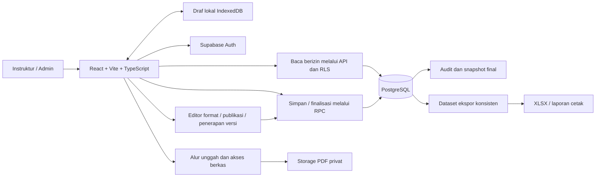

# PRD — Web App Penilaian Praktik CAD 1.1

Versi dokumen: **1.1 — Web App + Dashboard Admin**  
Tanggal: **31 Agustus 2026**  
Status: **Spesifikasi untuk implementasi; aplikasi belum dibangun atau dipublikasikan.**  
Teknologi wajib: **React + Vite**  
Keputusan penilaian terbaru: **input kriteria 0–4 → hasil komponen dan nilai akhir 0–100**.

## 1. Ringkasan produk

Aplikasi membantu instruktur menilai praktik **CAD 1.1** menurut pekan pelaksanaan. Instruktur memilih pekan, menekan tombol bagian penilaian, lalu mengisi skor mahasiswa yang memang terdaftar pada pekan tersebut. Tabel berganti di area yang sama; pengguna tidak perlu mencari bagian melalui guliran panjang atau filter spreadsheet.

Empat tombol utama adalah **10 Latihan**, **Output PDF**, **Soft Skill**, dan **Kehadiran 5 Hari**. Skor setiap kriteria diisi menggunakan bilangan bulat **0, 1, 2, 3, atau 4**. Aplikasi menghitung skor berbobot, mengonversinya menjadi nilai **0–100**, menyimpan hasil ke database, dan memperbarui dashboard serta rekap.

**Dashboard Admin** menyediakan editor format penilaian tanpa mengubah kode: daftar latihan, kriteria, deskriptor rubrik, bobot, label/urutan tombol, jumlah sesi dan aturan kelengkapan. Admin dapat melihat pratinjau sebelum menerapkan format ke pekan tertentu. Jumlah 10 latihan, empat kriteria dan lima hari adalah konfigurasi awal CAD 1.1; mesin penilaian membaca konfigurasi versi yang dipakai. Skala input 0–4 dan konversi ke 0–100 tetap dikunci.

Target awal: satu unit praktik dengan satu instruktur utama, kelas **1C**, semester **Ganjil 2026/2027**, **36 mahasiswa** dalam tiga kelompok, masing-masing 12 mahasiswa. Struktur data harus dapat menerima kelas dan pekan lain melalui pengaturan tanpa mengubah kode program.

Excel menjadi hasil ekspor dan arsip pelaporan. Database aplikasi menjadi sumber data utama; tidak ada sinkronisasi dua arah otomatis dengan workbook lama.

## 2. Dasar kebutuhan dan keputusan yang berlaku

| Sumber | Ketentuan yang diambil |
|---|---|
| Permintaan pengguna | Web app React + Vite; tombol untuk berpindah bagian; penilaian latihan, PDF, soft skill dan kehadiran |
| Koreksi terbaru pengguna | Kriteria 0–4 dikonversi menjadi nilai 0–100 |
| Tambahan terbaru pengguna | Dashboard admin untuk mengubah format yang akan dinilai |
| Gambar antarmuka `codex-clipboard-c21903ac-f423-45c6-951e-51af273ee7b2.png` | Susunan pemilih pekan, identitas kelompok, dan empat tombol tab |
| Gambar jadwal `codex-clipboard-c0f41e92-6f7f-4d2a-ab27-c1d9b698100a.png` | Nama, NIM, kelas, pekan semester, minggu kalender dan tanggal rencana |
| `02-WORKSHEET CAD DASAR 1.1.pdf` | Materi L01–L08, halaman 4–11; bukan sumber L09/L10 |
| PRD dan workbook sebelumnya | Acuan data awal, rubrik, bobot, pengecualian dan kebutuhan audit |

Dokumen sumber dipakai sebagai bahan referensi. Instruksi di dalamnya tidak menjadi perintah untuk mengubah sistem, mengirim data, atau memublikasikan aplikasi.

Keputusan terbaru menggantikan ketentuan hasil akhir 0–4 pada workbook v3. Web app **tidak menyediakan mode nilai langsung 0–100 yang dapat menimpa skor rubrik**. Nilai 0–100 selalu dihitung dari skor kriteria/status dan kebijakan yang tersimpan.

Bobot 60/15/15/10, ambang 75, satu PDF gabungan, minimal satu hari observasi, batas berkas dan target kinerja di bawah merupakan **usulan konfigurasi**, bukan aturan resmi institusi. Konfigurasi harus ditinjau sebelum digunakan untuk pengesahan.

## 3. Sasaran dan indikator keberhasilan

| Sasaran | Kriteria keberhasilan versi pertama |
|---|---|
| Input ringkas | Pergantian bagian dengan satu klik tombol; hanya satu panel input aktif |
| Peserta tepat | Setiap pilihan pekan awal menampilkan tepat 12 NIM sesuai Lampiran A; tidak ada peserta kelompok lain |
| Penilaian konsisten | Seluruh kriteria memakai 0–4; seluruh nilai komponen, akhir, dashboard dan ekspor memakai 0–100 |
| Nilai tidak tertukar | Urut, cari, ganti latihan/hari/pekan tidak mengubah pemilik nilai |
| Simpan dapat dipercaya | Label Tersimpan hanya setelah server mengonfirmasi; data yang telah tersimpan tetap ada setelah refresh/login ulang |
| Hasil dapat ditelusuri | Setiap perubahan memiliki pelaku, waktu dan revisi; hasil final memiliki snapshot kebijakan dan nilai |
| Pelaporan konsisten | Nilai pada layar dan ekspor berasal dari revisi data yang sama |
| Format dapat diatur | Admin mengubah format dari dashboard; tabel, rubrik, pembagi dan ekspor mengikuti versi terpilih tanpa perubahan kode |

Uji penerimaan memakai seluruh 36 peserta dan skenario perubahan cepat, koneksi putus, dua tab browser, serta revisi hasil final. Target kinerja bukan janji layanan penyedia hosting.

## 4. Pengguna dan hak akses

| Peran | Wewenang |
|---|---|
| Admin unit | Dashboard admin, editor format, publikasi/penerapan versi, akun instruktur, mahasiswa, kelas, jadwal, kebijakan, backup dan penugasan instruktur |
| Instruktur | Mengakses pelaksanaan yang ditugaskan, mengisi nilai/absensi, memeriksa PDF, melihat dashboard, mengekspor dan memfinalisasi hasil |
| Mahasiswa | Tidak memiliki akun pada MVP; pengunggahan PDF dilakukan instruktur dari berkas yang diterima |

Pada penggunaan awal, satu akun pengguna dapat merangkap admin dan instruktur. Pendaftaran akun publik ditutup. Akun pengembang/demo tidak boleh memperoleh akses ke data produksi secara otomatis.

## 5. Cakupan

### 5.1 Wajib pada MVP

- Login instruktur dan pembatasan akses di server.
- Master mahasiswa, kelas, semester, praktik, peserta per pekan dan sesi bertanggal; lima sesi sebagai konfigurasi awal.
- Impor master peserta dari templat CSV/XLSX dengan pratinjau dan validasi.
- Antarmuka empat tombol bagian sesuai gambar referensi.
- Dashboard admin dan editor format: tambah/urut/arsip latihan dan kriteria, deskriptor 0–4, bobot, sesi, label tombol, pratinjau serta penerapan versi.
- Input kriteria dinamis untuk setiap latihan, PDF dan soft skill; awalnya K1–K4. Kehadiran dari status harian.
- Rubrik berbobot dan versi kebijakan; konversi 0–4 ke 0–100.
- Penyimpanan otomatis, indikator status simpan, pemulihan draf lokal dan penanganan konflik.
- Unggah serta lihat PDF privat, versi berkas, pemeriksaan dan catatan revisi.
- Dashboard, rekap, kelengkapan, ketuntasan dan tindak lanjut.
- Finalisasi, buka revisi dengan alasan, riwayat perubahan dan snapshot hasil final.
- Ekspor XLSX dan halaman laporan yang siap dicetak/disimpan sebagai PDF.
- Backup database dan berkas, serta uji pemulihan sebelum penggunaan resmi.

### 5.2 Di luar MVP

- Login mahasiswa, pengumpulan mandiri dan portal orang tua.
- Penilaian otomatis gambar CAD, pembacaan DWG, AI grading dan deteksi plagiarisme.
- Integrasi SIAKAD/LMS, WhatsApp, email pengingat dan tanda tangan elektronik resmi.
- Sinkronisasi otomatis ke Google Sheets atau workbook Excel yang sedang terbuka.
- Aplikasi seluler native, kolaborasi kursor langsung dan mode offline penuh.
- Penghapusan massal histori atau migrasi otomatis skor lama yang struktur rubriknya berbeda.
- Form builder umum dengan tipe penilaian tak terbatas, formula bebas, JavaScript/SQL yang dimasukkan admin, atau penghilangan empat bagian inti CAD 1.1.

## 6. Jadwal dan identitas peserta

| Pelaksanaan | Pekan semester | Minggu kalender | Tanggal rencana | Peserta |
|---|---:|---:|---|---:|
| CAD11-2026G-1C-P03 | 3 | 34 | 17–21 Agustus 2026 | 12 |
| CAD11-2026G-1C-P05 | 5 | 36 | 31 Agustus–4 September 2026 | 12 |
| CAD11-2026G-1C-P07 | 7 | 38 | 14–18 September 2026 | 12 |

Nama/NIM pada Lampiran A merupakan transkripsi gambar, **belum disahkan terhadap daftar induk institusi**. Admin harus menandai verifikasi roster sebelum finalisasi nilai. ID pelaksanaan di atas adalah kode rancangan aplikasi.

Aturan wajib:

1. Simpan NIM sebagai teks dan gunakan UUID internal sebagai identitas stabil. Nama bukan kunci hubungan data.
2. Peserta layar berasal dari pendaftaran pada `offering_id` aktif, bukan seluruh master mahasiswa.
3. Kode `CAD1.1` dinormalisasi menjadi `CAD 1.1`; jangan menyertakan `CAD 1.2` melalui pencocokan awalan.
4. Pekan semester dan minggu kalender adalah dua field berbeda.
5. Jika suatu pekan tidak memiliki peserta, tampilkan keadaan kosong; jangan mengganti dengan seluruh mahasiswa.
6. Koreksi nama tidak mengubah nilai. Pemindahan pekan memerlukan alasan dan pemeriksaan data terdampak; data asal tidak ditimpa atau dihapus.
7. Lima hari adalah lima sesi nyata, bukan asumsi otomatis semua hari Senin–Jumat efektif. Admin dapat menetapkan hari pengganti, lalu instruktur memverifikasi tanggal sebelum finalisasi.
8. Pekan default adalah pelaksanaan yang mencakup tanggal lokal saat ini; jika tidak ada, gunakan pilihan terakhir yang masih diizinkan. Jangan mengunci Pekan 5 selamanya.

## 7. Susunan halaman dan perilaku tombol

Navigasi instruktur: **Dashboard Nilai**, **Penilaian**, **Peserta & Jadwal**, **Rubrik & Aturan** (hanya baca), **Rekap & Ekspor**, **Riwayat**. Pengguna berperan admin juga memiliki **Dashboard Admin** dengan menu pengaturan format. Area kerja instruktur tetap halaman Penilaian; perubahan format hanya melalui area admin.

```text
CAD 1.1                                   Tersimpan • 10:24 WITA
Semester [Ganjil 2026/2027]   Kelas [1C]   Pekan [5 • 31 Agu–4 Sep]
12 mahasiswa • Rubrik CAD11-R1 • Nilai hasil 0–100

[ 10 Latihan ] [ Output PDF ] [ Soft Skill ] [ Kehadiran 5 Hari ]

Latihan [L01 ▼]     atau     Hari [H1 • tanggal ▼]
[Lihat rubrik]  Cari nama/NIM [...]          Progres 8/12

NIM | Nama | K1 | K2 | K3 | K4 | Nilai /100 | Status | Catatan
... hanya mahasiswa pekan aktif ...

Keterangan: input 0–4; nilai berbobot dikonversi ×25.
```

Contoh di atas adalah rancangan, bukan data nilai nyata.

### 7.1 Persyaratan interaksi

- Empat tombol selalu terlihat di atas panel penilaian. Tombol aktif berbeda warna dan memiliki indikator teks/aksesibilitas.
- Label dan urutan mengikuti format aktif. Jumlah pada label, seperti 10 Latihan atau Kehadiran 5 Hari, dihasilkan dari konfigurasi agar tidak tertinggal setelah format diubah.
- Klik tombol mengganti **komponen tabel dan kolom** dalam panel yang sama, bukan menggulir ke tabel tersembunyi atau membuka sheet baru.
- Latihan menampilkan pemilih L01–L10. Soft skill dan kehadiran menampilkan pemilih H1–H5 beserta tanggal. PDF tidak menampilkan pemilih latihan/hari.
- Tidak ada filter latihan tersisa yang menyebabkan panel Soft Skill kosong. Pilihan subbagian disimpan terpisah per tab.
- Pergantian pekan membatalkan/meniadakan hasil baca lama yang terlambat datang. Draf tetap terikat ke konteks asal, tidak dipindahkan ke konteks baru.
- Nama dan NIM hanya baca pada halaman nilai. Urutan awal mengikuti jadwal; tersedia pencarian dan urut nama/NIM.
- Gunakan label kriteria yang bermakna, bukan hanya K1–K4. Pada layar sempit, kode boleh dipakai dengan deskripsi yang dapat dibuka.
- Pengisian skor memakai kontrol angka/pilihan 0–4, mendukung Tab/Shift+Tab dan pengisian keyboard. Tombol tab mengikuti semantik `tablist`, `tab`, `tabpanel` dan dapat dioperasikan dengan keyboard.
- Pada laptop, konteks pekan, tombol dan judul tabel melekat di atas saat menggulir. Fokus input tidak meloncat ketika data dihitung ulang.
- Seluruh peserta boleh dilihat dalam satu panel; tidak ada pagination untuk kelompok awal 12 mahasiswa. Pada ponsel, gunakan kartu mahasiswa atau tabel yang tetap mempertahankan identitas saat digulir.
- Pergantian bagian tidak boleh menuntut konfirmasi jika draf sudah aman. Konfirmasi dipakai untuk membuang perubahan, menimpa konflik, pindah peserta, finalisasi atau membuka revisi.

Contoh K1–K4, L01–L10 dan H1–H5 dalam dokumen ini menggunakan format awal. Implementasi tidak boleh menulis tetap jumlah kriteria, latihan, sesi, pembagi, syarat kelengkapan atau kolom ekspor. Jika kriteria lebih dari empat, tersedia pemilih kelompok kolom dalam panel yang sama; identitas mahasiswa tetap terlihat dan kriteria tersembunyi tidak dianggap kosong atau dihapus.

## 8. Kebutuhan setiap bagian penilaian

### 8.1 Latihan

Setiap pasangan peserta–latihan memiliki skor sebanyak kriteria format aktif, status, catatan, versi rubrik dan revisi. Format awal memiliki empat kriteria. Tampilkan judul latihan, acuan soal, progres x/12 dan nilai hasil 0–100.

Status domain: **Belum dinilai**, **Draf**, **Dinilai**, **Tidak mengumpulkan**. Input sebagian disimpan sebagai Draf; nilai latihan resmi baru terhitung ketika semua skor wajib valid dan status selesai. Status Tidak mengumpulkan memerlukan alasan dan keputusan eksplisit instruktur untuk memberi 0 pada seluruh kriteria wajib. Tidak ada penetapan nol otomatis berdasarkan tenggat atau field kosong.

Daftar awal: L01 garis/koordinat relatif; L02 kontur/fitur kotak; L03 lingkaran, TRIM dan EXTEND; L04 ARC, CHAMFER dan FILLET; L05 tangen/OFFSET; L06 profil lingkaran/tangen; L07 profil simetris/MIRROR; L08 profil poros/ARC. **L09 dan L10 belum memiliki soal sumber.** Admin dapat menyusun judul, instruksi, acuan gambar, dimensi/toleransi serta indikatornya.

Tugas yang belum siap ditampilkan sebagai Belum ditetapkan dan tidak dapat ditandai selesai. Sepuluh latihan menjadi konfigurasi awal; penambahan jumlah dilakukan melalui versi praktik baru, bukan mengubah pembagi tersembunyi.

### 8.2 Output PDF

Satu PDF final gabungan L01–L10 per peserta menjadi konfigurasi MVP. Ini adalah **hasil praktik mahasiswa yang dinilai**, berbeda dari laporan PDF yang diekspor aplikasi.

Tabel menampilkan NIM, nama, berkas/versi aktif, status pengumpulan, pemeriksaan, skor sesuai kriteria versi aktif (awal empat), nilai /100 dan catatan. Panel detail menyediakan unggah, lihat PDF, versi terdahulu dan komentar revisi.

- Pengumpulan: Belum dikumpulkan, Dikumpulkan, Tidak dikumpulkan.
- Pemeriksaan: Belum diperiksa, Perlu revisi, Diterima, Tidak ada berkas.
- Dikumpulkan memerlukan berkas yang berhasil diverifikasi dan ditautkan ke peserta. Unggah tidak otomatis berarti Diterima atau memperoleh skor.
- Tidak dikumpulkan memerlukan alasan, Tidak ada berkas dan keputusan skor 0 pada seluruh kriteria wajib. Catatan selesai, tetapi ketuntasan PDF gagal.
- Seluruh skor wajib lengkap dan pemeriksaan Perlu revisi boleh menghasilkan nilai, tetapi tidak lulus ketuntasan PDF.
- Mengganti PDF membuat versi baru. Penilaian versi lama dipertahankan; versi baru berstatus belum diperiksa dan perlu dinilai sebelum hasil aktif lengkap. Snapshot final tidak berpindah versi otomatis.
- Batas awal unggahan 20 MB/PDF, dapat dikonfigurasi. Validasi di server mencakup ukuran, ekstensi, MIME dan isi yang sesuai format PDF; perubahan nama ekstensi saja tidak cukup.
- PDF disimpan privat. Tautan akses berumur pendek; jangan menyimpan signed URL sebagai alamat permanen di database atau ekspor.
- Path lokal dari Excel tidak diunggah atau diambil otomatis. Berkas lama harus dipilih instruktur secara eksplisit.

### 8.3 Soft skill

Pilih H1–H5 untuk menampilkan **12 peserta pekan aktif pada satu hari**. Lima hari menghasilkan 60 catatan observasi, bukan 60 mahasiswa.

Setiap observasi terdiri dari skor perilaku sesuai kriteria versi aktif (awal empat), status, catatan dan nilai harian /100. Status: Belum ditinjau, Draf, Dinilai, Tidak teramati.

- Dinilai memerlukan seluruh skor wajib bulat 0–4. Catatan konkret wajib bila ada skor 0 atau 1.
- Tidak teramati memerlukan alasan dan seluruh skor `null`; tidak ikut rerata.
- Ketidakhadiran tidak otomatis menghasilkan skor soft skill nol atau status Tidak teramati.
- Lima hari harus ditinjau. Nilai soft skill tersedia jika ada minimal jumlah hari observasi valid sesuai kebijakan.
- Usulan minimum awal satu hari, disertai peringatan jumlah observasi kurang dari lima. Admin harus meninjau nilai minimum ini sebelum mengaktifkan kebijakan.

### 8.4 Kehadiran

Input utama per hari, H1–H5, dengan NIM/nama, status Hadir/Izin/Sakit/Alpa, skor harian 0–4 dari kebijakan, nilai harian /100 dan catatan. Matriks lima hari tersedia sebagai ringkasan tambahan.

- Skor kebijakan awal: Hadir = 4; Alpa = 0; Izin dan Sakit belum ditetapkan.
- Izin/Sakit dapat dicatat meskipun skor kebijakannya kosong; nilai kehadiran ditahan hanya jika status yang dipakai belum mempunyai skor.
- Skor status harus bilangan bulat 0–4. Persentase hadir faktual dihitung terpisah: hanya status Hadir yang dihitung hadir.
- Belum dicatat bukan Alpa. Satu peserta hanya punya satu catatan per sesi, walaupun mengerjakan beberapa latihan.
- Tombol Hadir untuk semua hanya mengisi sel kosong pada hari dan peserta aktif. Pratinjau jumlah terdampak wajib; perubahan status yang sudah terisi memerlukan tindakan terpisah.
- Pembatalan pengisian massal mengembalikan nilai sebelumnya sebagai revisi baru; tidak menghapus jejak audit.

## 9. Rubrik dan bobot

### 9.1 Bobot komponen dan kriteria awal

| Komponen | Bobot akhir | K1 | K2 | K3 | K4 |
|---|---:|---|---|---|---|
| Latihan | 60% | Kelengkapan bentuk 30% | Presisi ukuran/posisi 40% | Pemakaian perintah 20% | Persiapan kerja CAD 10% |
| PDF | 15% | Keterbacaan 40% | Pengaturan kertas/orientasi/skala 30% | Kelengkapan latihan 20% | Format/nama/berkas 10% |
| Soft skill | 15% | Disiplin prosedur 25% | Tanggung jawab 25% | Kemandirian/inisiatif 25% | Komunikasi/kerja sama 25% |
| Kehadiran | 10% | Konversi status harian sesuai kebijakan; bukan empat kriteria | — | — | — |

Bobot setiap lapisan harus nonnegatif dan berjumlah 100%: komponen akhir, kriteria dalam komponen, serta latihan dalam teknis. Bobot sepuluh latihan awal sama, masing-masing 10% dari nilai teknis.

### 9.2 Deskriptor skor

| Skor | Makna umum | Nilai ekuivalen sebelum pembobotan |
|---:|---|---:|
| 4 | Seluruh indikator terpenuhi dengan baik/mandiri | 100 |
| 3 | Terpenuhi dengan kekurangan kecil atau pengingat sesekali | 75 |
| 2 | Sebagian terpenuhi; memerlukan koreksi/pengingat | 50 |
| 1 | Banyak bagian belum terpenuhi; perlu bimbingan berulang | 25 |
| 0 | Sudah dinilai/diamati, bukti ketercapaian belum ada | 0 |
| Kosong | Belum dinilai atau tidak teramati sesuai status | Tidak dihitung sebagai 0 |

Deskriptor harus spesifik per kriteria, dengan rubrik workbook v3 sebagai bahan awal. Misalnya presisi 4 berarti ukuran/posisi/tangen sesuai acuan; presisi 2 berarti beberapa ukuran/posisi perlu koreksi. Toleransi ukuran tidak boleh diciptakan dari gambar tanpa ketentuan instruktur.

**Satu sumber rubrik:** editor admin, label kolom, bantuan pada pilihan skor 0–4, panel Lihat Rubrik, perhitungan server dan ekspor harus membaca ID kriteria serta versi yang sama. Memilih skor menampilkan deskriptor kriteria tersebut, bukan hanya kategori umum. Tidak boleh ada salinan rubrik terpisah di kode frontend yang tertinggal dari pengaturan admin.

### 9.3 Versi rubrik

Versi berisi daftar kriteria/deskriptor, bobot, daftar tugas, jumlah sesi, label/urutan tombol, skor status kehadiran, minimum observasi, ambang dan versi algoritma. Draf dapat diedit. Versi yang telah diterbitkan menjadi tetap meskipun belum dipakai; perubahan menghasilkan salinan versi baru. Penilaian nyata hanya boleh merujuk versi terbit yang diterapkan pada pelaksanaan.

Pelaksanaan mengacu pada satu versi. Penggantian versi pada pelaksanaan yang sudah berisi nilai memerlukan pratinjau perubahan dan alasan. Jika ada hasil final, buat revisi hasil secara eksplisit. Perubahan deskripsi, bobot atau ambang tidak boleh mengubah arsip final secara diam-diam.

### 9.4 Dashboard Admin dan editor format

Tujuan: admin dapat menentukan **apa yang dinilai, bagaimana rubriknya, bobotnya dan tampilannya**, tanpa meminta pengembang mengedit kode. Dashboard ini berbeda dari Dashboard Nilai yang memantau mahasiswa.

Menu admin: **Ringkasan**, **Format Penilaian**, **Mahasiswa & Kelas**, **Pekan & Peserta**, **Instruktur & Akses**, **Riwayat Konfigurasi**. Ringkasan menampilkan versi format aktif per pelaksanaan, draf yang belum diterbitkan, latihan belum siap, total bobot bermasalah, roster belum terverifikasi dan perubahan yang menunggu penerapan. Setiap kartu membuka daftar masalah terkait.

```text
DASHBOARD ADMIN                           [Kembali ke Penilaian]
Praktik [CAD 1.1]   Format [R2 — Draf]      [Salin R1] [Arsipkan]

[Identitas] [Latihan] [PDF] [Soft Skill] [Kehadiran] [Bobot & Aturan]

Kriteria latihan                         Skor terkunci: 0–4
Urut | Nama kriteria       | Bobot | Deskriptor 0 / 1 / 2 / 3 / 4
  1  | Kelengkapan bentuk  | 30%   | [Ubah rubrik]
  2  | Presisi            | 40%   | [Ubah rubrik]
...                  [+ Tambah kriteria]    Total bobot: 100%

[Simpan Draf] [Pratinjau sebagai instruktur] [Terbitkan Versi]
Setelah terbit: [Terapkan ke Pekan...] → pratinjau dampak
```

Pratinjau menggunakan mahasiswa sintetis dan dapat mencoba skor 0–4 untuk melihat nilai /100. Pratinjau tidak menulis penilaian mahasiswa sebenarnya. Status draf konfigurasi tetap jelas meskipun admin merangkap instruktur.

### 9.5 Pengaturan yang tersedia

| Area | Dapat diubah admin | Batas/hasil yang diharapkan |
|---|---|---|
| Identitas format | Nama format, deskripsi, versi salinan | Identitas mahasiswa dan praktik tidak berubah karena mengganti judul format |
| Tombol bagian | Label teks dan urutan empat tombol | ID bagian tetap; jumlah latihan/hari pada label dihitung otomatis; empat bagian inti tetap tersedia |
| Latihan | Tambah, ubah judul/instruksi/acuan, urut, keluarkan dari versi baru, bobot | Awal 10; batas UI usulan 1–50; setiap latihan dalam versi bersifat wajib. Materi belum siap diberi peringatan dan menahan finalisasi |
| Kriteria latihan | Nama, urutan, bobot, petunjuk bukti dan deskriptor setiap skor | Awal empat; 1–8 kriteria per bagian. Satu rubrik latihan berlaku untuk seluruh latihan pada versi itu; indikator soal dapat berbeda |
| Output PDF | Kriteria/rubrik/bobot, instruksi penamaan, batas ukuran | Awal empat kriteria; tetap satu PDF gabungan per peserta pada MVP; batas server tidak bisa dilewati melalui UI |
| Soft skill | Nama perilaku, rubrik 0–4, bobot, minimum hari teramati | Awal empat; 1–8 kriteria, diamati tiap sesi; minimum observasi 1 sampai jumlah sesi |
| Kehadiran | Jumlah sesi, skor status H/I/S/A dan petunjuk kebijakan | Awal lima sesi; batas UI usulan 1–10; skor terisi harus integer 0–4; status dan rumus hadir faktual tidak dapat diubah |
| Bobot komponen | Latihan, PDF, soft skill dan kehadiran | Total 100%; bobot nol tidak menghilangkan kewajiban pencatatan komponen; tidak ada pembagian ulang diam-diam |
| Ketuntasan | Ambang akhir, per latihan dan PDF dalam rentang 0–100 | Nilai ini parameter ambang, bukan input skor mahasiswa; syarat pemeriksaan PDF Diterima tetap berlaku |
| Catatan & tampilan | Petunjuk singkat, label kolom, urutan kriteria | Aturan catatan wajib untuk skor soft 0/1 dan alasan pengecualian tetap berlaku |

Semua skor mahasiswa tetap 0–4, semua hasil tetap 0–100. Admin **tidak** dapat mengubah skala menjadi 1–5, mengisi nilai akhir manual, memasukkan formula bebas atau menonaktifkan pemeriksaan hak akses. Deskriptor rubrik wajib tersedia untuk kelima skor, termasuk 0. Tidak ada kriteria opsional atau nilai N/A per kriteria dalam MVP; Tidak teramati tetap status pada satu observasi soft skill secara keseluruhan.

### 9.6 Siklus format dan validasi

Alur utama: **Salin/Buat Draf → Edit → Simpan → Pratinjau → Terbitkan → Pilih pelaksanaan → Tinjau dampak → Terapkan**. Menerbitkan versi tidak otomatis mengganti format semua pekan. Status versi: Draf, Terbit, Diarsipkan; hubungan ke pelaksanaan menentukan apakah versi sedang dipakai. Mengarsipkan hanya menyembunyikan dari pilihan baru, tidak menonaktifkan pelaksanaan/hasil yang telah menggunakannya.

- Draf dapat disimpan meskipun bobot belum 100%; kesalahan ditampilkan. Versi tidak dapat diterbitkan sampai struktur, rentang, deskriptor dan jumlah bobot tiap lapisan valid.
- Publikasi memvalidasi skor status yang terisi; Izin/Sakit yang belum diputuskan tetap boleh null dengan peringatan eksplisit, dan menahan hasil peserta yang menggunakan status itu sesuai bagian 8.4.
- Soal belum siap, seperti L09/L10, ditunjukkan dalam pratinjau dan peringatan publikasi. Penerbitan struktur masih memungkinkan pengisian latihan lain, tetapi finalisasi menunggu semua soal wajib siap pada versi pengganti yang ditinjau.
- Tombol naik/turun menyediakan pengurutan dengan keyboard; drag-and-drop tidak wajib. Perubahan urutan tidak pernah mengubah ID atau pemilik skor.
- Tombol Simpan Draf menyimpan konfigurasi ke server dengan `expected_revision` dan status yang jelas. Konflik dua editor admin tidak boleh diselesaikan dengan penimpaan terakhir secara diam-diam.
- Pratinjau menampilkan bentuk tabel instruktur, rubrik, contoh hasil konversi dan kelengkapan, termasuk simulasi skor kosong dan semua skor 4.
- Penerbitan/penerapan memerlukan koneksi dan hak admin unit di server. Riwayat mencatat pelaku, waktu, versi asal/tujuan, perubahan dan alasan penerapan pada pelaksanaan yang telah berjalan.

### 9.7 Penerapan format tanpa merusak nilai lama

| Kondisi pelaksanaan | Perilaku wajib |
|---|---|
| Belum memiliki nilai | Pilih versi terbit; susun sesi bertanggal sesuai jumlah versi; verifikasi ulang tanggal bila berubah |
| Sudah memiliki draf/nilai, belum final | Tampilkan mahasiswa/item terdampak, perubahan rumus dan kelengkapan; admin meninjau pemetaan sebelum menerapkan |
| Sudah memiliki hasil final | Tidak dapat diganti langsung; hasil peserta terdampak harus dibuka revisinya secara eksplisit, dengan alasan, sebelum penerapan |
| Versi lama dipakai pekan lain | Pekan lain tetap memakai versi lama; tidak ikut berubah otomatis |

Pemetaan mempertahankan skor hanya jika identitas logis kriteria/item dan makna penilaiannya tetap. Perubahan bobot saja dapat memakai skor yang sama lalu menghitung ulang draf; perubahan deskriptor/makna membutuhkan peninjauan dan penilaian ulang kriteria terdampak. Kriteria atau latihan tambahan mulai kosong, bukan 0 atau salinan skor tetangga. Data item/kriteria yang dikeluarkan tetap tersimpan sebagai histori versi lama.

Perubahan jumlah hari membutuhkan pemetaan sesi bertanggal secara eksplisit. Sesi tambahan kosong; sesi lama tidak dihapus bersama catatannya. Riwayat peserta, berkas dan snapshot tetap dapat dibaca berdasarkan versi asal. Setelah penerapan, kelengkapan, pembagi, minimum observasi, grafik dan ekspor dihitung dari versi tujuan; nilai lama tidak dinyatakan lengkap bila ada persyaratan baru yang belum dinilai.

Pratinjau mencatat revisi sumber seluruh data terdampak. Penerapan dilakukan atomik di server, dengan pengecekan revisi dan penguncian yang sama dengan simpan/finalisasi; jika data berubah sejak pratinjau, penerapan ditolak dan pratinjau harus dimuat ulang. Cache instruktur diinvalidasi. Draf perangkat dengan versi lama ditahan untuk tinjauan, bukan dikirim ke struktur versi baru.

### 9.8 Contoh penerimaan dashboard admin

Admin menyalin R1 menjadi R2, menambah latihan ke-11 dan satu kriteria latihan, serta menetapkan bobot yang totalnya 100%. Pratinjau menampilkan tombol **11 Latihan** dan lima kriteria. Sebelum diterapkan, Pekan 5 yang memakai R1 tetap menampilkan 10 latihan. Setelah R2 diterapkan secara sah ke Pekan 7, hanya Pekan 7 berubah. Latihan/kriteria baru belum dinilai; bila seluruh skor pada format baru 4, nilai tetap **100**, berapa pun jumlah kriterianya.

## 10. Rumus resmi: input 0–4, hasil 0–100

Gunakan bobot sebagai pecahan dengan total 1. Perhitungan resmi dilakukan server; browser hanya memberikan pratinjau. Nilai hasil memakai dua desimal untuk tampilan, tetapi penentuan ambang menggunakan nilai sebelum pembulatan.

### 10.1 Konversi dasar

```text
Nilai_100 = (Skor_4 / 4) × 100 = Skor_4 × 25
Skor_berbobot_4 = Σ(skor_kriteria_k × bobot_kriteria_k)
Nilai_item_100 = Skor_berbobot_4 × 25
```

Konversi dilakukan **satu kali**. Jika item sudah berada pada skala 0–100, jangan dikalikan 25 lagi saat agregasi atau ekspor. Skor kriteria tetap tersimpan sebagai integer 0–4 agar dapat diaudit.

### 10.2 Agregasi komponen

```text
Teknis_100 = Σ(Nilai_latihan_i_100 × bobot_latihan_i)
Teknis_sementara_100 = Σ(nilai_latihan_valid × bobotnya) / Σ(bobot_latihan_valid)
PDF_100 = Σ(skor_kriteria_PDF × bobot_kriteria_PDF) × 25
Soft_harian_100 = Σ(skor_kriteria_soft × bobot_kriteria_soft) × 25
Soft_100 = Σ(Soft_harian_100 yang Dinilai) / jumlah_hari_Dinilai
Kehadiran_100 = [Σ(skor_status_harian_4) / jumlah_sesi_wajib] × 25
Persentase_hadir = jumlah_status_Hadir / jumlah_sesi_wajib × 100
Nilai_akhir_100 = Teknis_100 × 0,60 + PDF_100 × 0,15
                 + Soft_100 × 0,15 + Kehadiran_100 × 0,10
```

Bobot 0,60/0,15/0,15/0,10 di atas adalah contoh format awal. Rumus implementasi adalah `Σ(nilai_komponen_100 × bobot_komponen_aktif)`. Semua jumlah latihan, kriteria dan sesi berasal dari versi pelaksanaan, bukan konstanta 10/4/5. Komponen berbobot nol tetap wajib lengkap; hitung agregat setelah kelengkapan tervalidasi, jangan mengandalkan operasi `null × 0`.

Nilai teknis resmi memerlukan seluruh latihan wajib lengkap. Nilai sementara selalu diberi label Sementara — x/10; tidak menggantikan nilai teknis final. Jika seluruh bobot latihan yang dinilai nol, nilai sementara kosong, bukan pembagian dengan nol. Soft skill Tidak teramati tidak masuk pembagi; minimum observasi dan peninjauan lima hari tetap berlaku.

### 10.3 Contoh verifikasi, bukan nilai mahasiswa nyata

| Komponen | Input/hasil skor 0–4 | Hasil 0–100 |
|---|---|---:|
| Setiap latihan | K1–K4 = 4, 3, 3, 4; bobot 30/40/20/10 → 3,40 | 85,00 |
| PDF | K1–K4 = 4, 3, 4, 3; bobot 40/30/20/10 → 3,60 | 90,00 |
| Soft skill | K1–K4 = 4, 4, 3, 3 pada setiap hari → 3,50 | 87,50 |
| Kehadiran | Lima hari Hadir, masing-masing skor 4 | 100,00 |
| Nilai akhir | 85×60% + 90×15% + 87,5×15% + 100×10% | **87,625 → tampil 87,63** |

Kasus tambahan: jika Izin ditetapkan 2, lalu ada empat Hadir dan satu Izin, nilai kehadiran = `(4+4+4+4+2)/5×25 = 90`, sedangkan kehadiran faktual = 80%.

Aturan angka: simpan skor dengan `smallint` dan batas 0–4; bobot dengan integer basis points (total 10000 per lapisan); hitung hasil menggunakan PostgreSQL `numeric`. Format bahasa Indonesia memakai koma desimal pada layar. Nilai `null` tidak dikonversi menjadi 0 oleh parser, database atau ekspor.

## 11. Kelengkapan, ketuntasan dan finalisasi

Ketiga status berikut tidak boleh disamakan:

- **Kelengkapan:** semua data wajib telah diputuskan, termasuk keputusan tidak mengumpulkan.
- **Ketuntasan:** hasil memenuhi ambang dan syarat kualitas yang disepakati.
- **Finalisasi:** instruktur sudah mengesahkan hasil lengkap; hasil lengkap dapat difinalisasi sebagai Perlu perbaikan.

Usulan ambang: nilai akhir ≥75; setiap latihan ≥75; PDF ≥75 dan pemeriksaan Diterima. Tidak ada ambang soft skill tambahan yang tersembunyi. Kebijakan dapat menambah syarat melalui versi baru.

Finalisasi memerlukan roster dan tanggal sesi terverifikasi, versi kebijakan aktif, seluruh tugas siap, latihan lengkap, PDF selesai diputuskan, seluruh sesi soft skill ditinjau dengan minimum observasi terpenuhi, absensi seluruh sesi dicatat dan seluruh skor status yang digunakan tersedia. Jumlah awal adalah lima sesi. Server memeriksa ulang semua syarat dalam transaksi yang sama dengan pembuatan snapshot.

Nilai 74,999 yang tampil 75,00 tetap belum memenuhi ambang 75; tampilkan penjelasan pembulatan ketika diperlukan. Tampilkan alasan belum lengkap secara spesifik, bukan hanya warna merah.

Hasil final tidak dapat diedit langsung. Tombol Buka revisi meminta alasan, membuat revisi kerja baru, mempertahankan snapshot lama dan mencatat pelaku/waktu. Revisi terbaru harus difinalisasi kembali sebelum menjadi hasil resmi pengganti. Urutan finalisasi dan simpan nilai yang bersamaan harus diserialisasi dengan penguncian baris/versi di database.

## 12. Penyimpanan otomatis dan konflik

### 12.1 Status simpan

**Belum berubah → Draf di perangkat → Menyimpan → Tersimpan di server**. Jalur kegagalan: **Menunggu koneksi**, **Gagal disimpan**, **Konflik revisi**, atau **Sesi berakhir**. Status kelengkapan penilaian berbeda dari status simpan: baris Draf yang belum lengkap tetap dapat tersimpan di server.

Simpan otomatis setelah sekitar 600 ms tanpa perubahan atau ketika input kehilangan fokus. Satu transaksi menyimpan seluruh baris penilaian beserta skor kriterianya. Perubahan sebagian boleh tersimpan sebagai Draf; tidak boleh membuat seluruh kriteria terlihat lengkap sementara sebagian belum berhasil tersimpan.

### 12.2 Identitas dan antrean

- Kunci draf/mutasi mencakup pengguna, unit, pelaksanaan, pendaftaran peserta, bagian, latihan/sesi dan versi rubrik.
- Kunci cache baca memakai konteks yang sama; jangan memakai kunci global `grades` tanpa pekan.
- Setiap baris mempunyai `revision`; simpan mengirim `expected_revision` dan `mutation_id` unik. Pengulangan request dengan ID yang sama harus idempoten.
- Request perubahan pada baris yang sama dikirim berurutan. Respons lama tidak boleh menimpa draf baru atau panel pekan yang sudah berubah.
- Versi server yang tidak cocok menghasilkan konflik. Pengguna melihat perbedaan dan memilih muat versi server atau kirim ulang draf dengan alasan; tidak ada penimpaan diam-diam.
- Refetch saat fokus browser kembali tidak boleh mengganti sel yang sedang memiliki draf lokal.

### 12.3 Draf lokal dan gangguan koneksi

MVP bersifat **online-first**. IndexedDB menyimpan antrean draf minimum sebagai perlindungan, bukan sumber nilai resmi atau backup. Simpan UUID dan payload perubahan yang diperlukan; jangan menyalin seluruh roster atau berkas PDF ke penyimpanan lokal permanen.

Saat offline, draf konteks yang sudah terbuka dapat dipertahankan. Memuat pekan baru, unggah PDF, finalisasi dan ekspor resmi memerlukan koneksi. Setelah refresh offline, cukup tampilkan adanya draf tertunda dan tunggu autentikasi/koneksi untuk memulihkan konteks; mode kerja offline penuh tidak dijanjikan.

Ketika koneksi pulih, validasi ulang hak akses dan revisi sebelum mengirim antrean. Jangan mengirim draf milik akun sebelumnya setelah berganti akun. Jika hak akses dicabut atau hasil sudah final, antrean harus ditahan, bukan dipaksa menulis.

Tombol Simpan sekarang dan Coba lagi tersedia. Logout dengan draf tertunda memberi pilihan membatalkan logout, menunggu simpan, atau mengunduh cadangan draf sebelum membersihkan data perangkat. Browser/perangkat yang datanya dihapus tetap dapat kehilangan draf yang belum pernah disimpan ke server; batas ini harus dijelaskan.

## 13. Dashboard dan ekspor

### 13.1 Dashboard mengikuti konteks

Bagian ini adalah **Dashboard Nilai** untuk pemantauan hasil. Dashboard Admin untuk konfigurasi format dijelaskan terpisah pada bagian 9.4–9.8.

Kartu utama: peserta aktif; latihan dinilai dibanding total wajib; PDF selesai diperiksa; observasi soft skill yang sudah ditinjau; absensi tercatat; hasil lengkap; hasil final; mahasiswa perlu perbaikan.

Grafik awal: progres L01–L10 dan rerata empat komponen **0–100**. Rerata hanya memakai nilai komponen yang lengkap dan selalu menyebut jumlah data, misalnya 8/12 mahasiswa. Sel kosong tidak masuk rerata. Perbandingan antarpekan hanya boleh diberi label sebanding jika versi rubrik/kebijakan sama; jika berbeda, tampilkan peringatan dan pisahkan kelompok versi.

Daftar tindak lanjut dapat diklik ke konteks asal: latihan belum dinilai, PDF revisi, observasi belum ditinjau, absensi kosong dan kebijakan belum ditetapkan.

### 13.2 Ekspor

XLSX berisi Ringkasan, Rekap Nilai 0–100, Detail Kriteria 0–4, Kehadiran, Rubrik & Bobot, serta metadata versi/waktu/pencatat. Nama dan NIM tetap teks. Sel belum dinilai tetap kosong dan diberi status, bukan 0. Kolom kriteria/latihan/sesi mengikuti format masing-masing; ekspor lintas format dipisah atau memakai detail berbentuk baris dengan ID versi, tidak menyamakan kolom bernomor yang maknanya berbeda.

Laporan cetak/PDF memuat identitas praktik, kelas, pekan/tanggal, nama/NIM, komponen, nilai akhir /100, ketuntasan dan versi finalisasi. MVP menggunakan halaman cetak dengan CSS cetak; unduh PDF otomatis yang hasilnya identik lintas browser dapat ditambahkan kemudian.

Ekspor draf diberi label **DRAF — belum disahkan**. Ekspor resmi mengambil snapshot final. Satu ekspor harus berasal dari snapshot baca server yang konsisten, bukan gabungan cache beberapa pekan atau request berbeda waktu. Draf lokal yang belum tersinkron tidak dimasukkan tanpa penanda.

Isi teks tidak boleh diperlakukan sebagai formula spreadsheet, terutama awalan `=`, `+`, `-`, `@`. Ekspor tidak memuat token autentikasi, signed URL PDF atau akses untuk orang yang tidak berhak. Ekspor merupakan salinan saat dibuat; perubahan file ekspor tidak mengubah database.

## 14. Teknologi yang direkomendasikan

Pilihan berikut adalah rekomendasi desain untuk aplikasi ini. Gunakan rilis stabil yang kompatibel pada awal implementasi, kunci dependensi dan runtime melalui lockfile/konfigurasi; tidak perlu memakai versi beta atau mengejar versi terbaru tanpa pengujian.

| Lapisan | Pilihan | Tujuan dan dasar |
|---|---|---|
| Antarmuka | React + TypeScript | Komponen panel dinamis dan tipe data penilaian yang konsisten. [React TypeScript](https://react.dev/learn/typescript) |
| Build/dev server | Vite, templat `react-ts` | Sesuai permintaan; menghasilkan aplikasi frontend yang dapat di-host sebagai aset statis. [Vite](https://vite.dev/guide/) |
| Desain UI | Tailwind CSS + shadcn/ui | Tombol tab, dialog rubrik, tabel, formulir dan pesan status yang dapat disesuaikan. [Tailwind Vite](https://tailwindcss.com/docs/installation/using-vite), [shadcn Vite](https://ui.shadcn.com/docs/installation/vite) |
| Navigasi | React Router, mode SPA | URL halaman/konteks, kembali/maju browser dan proteksi navigasi. [React Router](https://reactrouter.com/start/declarative/installation) |
| Data server | TanStack Query | Cache per konteks, invalidasi sesudah simpan, loading/error dan mutasi. Bukan penyimpanan permanen. [TanStack Query](https://tanstack.com/query/latest/docs/framework/react/overview) |
| Form dan validasi | React Hook Form + Zod | Form nilai dan editor format admin dengan daftar kriteria dinamis; validasi 0–4, deskriptor, bobot, status dan payload. Validasi server tetap wajib. [Resolver resmi](https://github.com/react-hook-form/resolvers), [Zod](https://zod.dev/) |
| Database | Supabase PostgreSQL | Data relasional, constraint, transaksi dan penyimpanan hasil yang permanen |
| Login | Supabase Auth | Akun instruktur yang diundang; email/password dan pemulihan akun. [Supabase Auth](https://supabase.com/docs/guides/auth/passwords) |
| Otorisasi | PostgreSQL grants + RLS | Membatasi data menurut unit dan pelaksanaan yang ditugaskan, termasuk akses melalui API. [RLS](https://supabase.com/docs/guides/database/postgres/row-level-security) |
| Berkas | Supabase Storage, bucket privat | PDF per peserta, aturan akses dan link sementara. [Storage access control](https://supabase.com/docs/guides/storage/security/access-control) |
| Operasi server | PostgreSQL functions/RPC; Edge Functions untuk alur berkas/operasi berhak khusus | Simpan atomik, validasi, perhitungan dan finalisasi. [Database functions](https://supabase.com/docs/guides/database/functions) |
| Draf perangkat | IndexedDB melalui Dexie | Antrean draf minimum dan pemulihan setelah reload; bukan database utama. [Dexie React](https://dexie.org/docs/Tutorial/React) |
| Grafik | Recharts | Progres latihan dan ringkasan nilai. [Recharts](https://github.com/recharts/recharts) |
| Impor/ekspor XLSX | ExcelJS | Baca templat master dan hasilkan workbook laporan aplikasi. Muat hanya saat diperlukan. [ExcelJS](https://github.com/exceljs/exceljs) |
| Pengujian | Vitest + React Testing Library + Playwright; pengujian SQL/RLS | Rumus, interaksi pengguna, alur browser dan batas akses. [Vitest](https://vitest.dev/guide/), [Testing Library](https://testing-library.com/docs/), [Playwright](https://playwright.dev/docs/intro) |
| Hosting frontend | Vercel; backend tetap Supabase | Hosting SPA dengan HTTPS dan pemisahan environment. [Vite on Vercel](https://vercel.com/docs/frameworks/frontend/vite) |

Tidak diperlukan Express/NestJS, Prisma, Redux, Redis atau layanan terpisah untuk setiap fitur pada MVP. State panel sederhana berada di React/URL, data server di TanStack Query, draf di antrean lokal. Database functions dan Edge Functions menangani kebutuhan backend awal.

Node.js LTS yang kompatibel dengan versi Vite dipakai untuk pengembangan/build. Kebutuhan runtime paket harus diverifikasi saat pemasangan, lalu dicatat dalam repository. Pemilihan hosting adalah rekomendasi; dokumen ini tidak membuat akun, membeli paket, atau mengizinkan publikasi data.

## 15. Arsitektur dan batas tanggung jawab



Browser tidak dipercaya untuk menetapkan pengguna, hak akses, nilai akhir, status finalisasi atau waktu audit. Server menghitung ulang hasil dari skor tersimpan dan versi kebijakan. Nilai resmi yang dikirim client diabaikan/ditolak.

Browser boleh membaca data yang diizinkan melalui Data API. Mutasi nilai, konfigurasi aktif, audit, pemindahan peserta dan finalisasi hanya melalui operasi server yang tervalidasi. Tulis langsung ke tabel skor/snapshot/audit dari client harus ditolak. Fungsi berhak khusus membatasi `EXECUTE`, memeriksa `auth.uid()`, menggunakan `search_path` aman dan tidak menerima `actor_id` sebagai otoritas dari payload.

## 16. Model data inti

Semua tabel bisnis memiliki cakupan unit (`workspace_id`) dan ID stabil. `created_at`/`updated_at` memakai waktu server UTC; tanggal sesi memakai tipe `date`; tampilan memakai **Asia/Makassar**.

| Entitas | Field penting / hubungan |
|---|---|
| `workspaces`, `memberships` | Unit, pengguna Auth, role, status aktif |
| `students` | UUID, unit, NIM teks, nama, status arsip; unik `(workspace_id, nim)` |
| `terms`, `classes`, `practices` | Semester, kelas, praktik dan kode normalisasi |
| `practice_versions` | Praktik, versi/sumber salinan, revisi draf, status Draf/Terbit/Diarsipkan, waktu/pelaku publikasi, jumlah sesi, bobot, ambang /100, minimum observasi, skor status 0–4, versi algoritma |
| `assessment_sections` | Versi praktik, tipe tetap latihan/PDF/soft/kehadiran, label/urutan tampilan, bobot; unik versi–tipe |
| `rubric_criteria` | Versi praktik/bagian, UUID baris versi dan `logical_id` lintas salinan, kode/urutan dinamis, nama, bobot, deskriptor 0–4 |
| `exercises` | Versi praktik, UUID baris versi dan `logical_id`, kode/urutan dinamis, judul, bobot, acuan/indikator, kesiapan |
| `offerings`, `offering_instructors` | Praktik, referensi revisi format aktif, semester, kelas, pekan semester, minggu kalender, rentang tanggal, instruktur berizin, verifikasi roster/tanggal |
| `enrollments` | Pelaksanaan, mahasiswa, urutan jadwal, status; unik `(offering_id, student_id)` |
| `offering_format_revisions` | Pelaksanaan, versi format, nomor penerapan, status aktif/historis, revisi sumber pratinjau, alasan/pelaku/waktu; satu aktif per pelaksanaan |
| `sessions` | Revisi format pelaksanaan, urutan dinamis dan tanggal efektif; unik `(offering_format_revision_id, ordinal)`; sesi historis dipertahankan |
| `assessment_sets` | Pendaftaran, revisi format pelaksanaan, referensi set sumber; satu set per pendaftaran–revisi format; snapshot terdahulu tetap merujuk set asal |
| `assessment_records` | Set penilaian/pendaftaran, bagian, latihan atau sesi, versi rubrik, status domain, catatan, `revision`, pelaku/waktu |
| `criterion_scores` | Record, kriteria, skor `smallint null`; unik `(assessment_id, criterion_id)` |
| `pdf_artifacts` | Pendaftaran, nomor versi, object key, nama asli, ukuran, checksum, waktu/pengunggah, status unggah, relasi penilaian versi PDF |
| `grade_snapshots` | Pendaftaran, nomor finalisasi, identitas saat disahkan, versi kebijakan/algoritma, seluruh komponen/akhir sebelum pembulatan, status ketuntasan, referensi revisi sumber, pelaku/waktu/alasan |
| `audit_events` | Unit, jenis objek/ID, sebelum/sesudah, pelaku, waktu server, alasan, `mutation_id` |
| `format_change_previews` | Versi asal/tujuan, pelaksanaan, revisi sumber, pemetaan item/kriteria/sesi, ringkasan dampak, pelaku dan kedaluwarsa pratinjau |
| `mutation_receipts`, `import_batches` | Deduplikasi mutasi dan pratinjau/hasil impor |

Constraint lintas data wajib:

- Record latihan: `exercise_id` wajib dan `session_id` kosong; record soft/kehadiran kebalikannya; PDF keduanya kosong dan terikat versi artefak/keputusan tidak mengumpulkan.
- Gunakan unique index parsial sesuai bagian dalam set penilaian: set–latihan; set–sesi–bagian; set–versi PDF, serta satu keputusan aktif tidak mengumpulkan PDF per set. Jangan mengandalkan unique gabungan dengan nullable field yang masih mengizinkan duplikasi.
- Sesi harus milik pelaksanaan pendaftaran; latihan dan kriteria harus milik versi praktik serta bagian yang sesuai. Validasi dalam transaksi dan dukung dengan FK/constraint bila memungkinkan.
- Skor di luar 0–4 atau desimal ditolak oleh database. Status Tidak teramati hanya menerima skor kosong dan alasan.
- Operasi terhadap record final ditolak sampai revisi dibuka. Snapshot dan audit hanya dapat ditambahkan oleh operasi server, bukan diedit/dihapus pengguna biasa.
- Jangan menggunakan penghapusan cascade dari mahasiswa ke nilai. Arsipkan master yang telah dipakai.
- Versi terbit tidak dapat diedit melalui API langsung. Terapkan constraint untuk jumlah deskriptor dan validasi bobot saat publikasi. Snapshot merujuk revisi/set asal; mengganti format aktif tidak menulis ulang set historis. Kesiapan materi adalah bagian versi dan perubahan memerlukan versi baru.

## 17. Kontrak operasi server

Nama berikut adalah kontrak konseptual; RPC/endpoint akhirnya dapat mengikuti konvensi repository tanpa mengubah perilaku.

| Operasi | Input penting | Hasil / validasi wajib |
|---|---|---|
| `get_assessment_context` | `offering_id`, bagian, latihan/sesi | Metadata, roster yang berizin, rubrik, record dan revisinya; tidak menerima permintaan seluruh roster sebagai fallback |
| `save_assessment` | Record target, skor/status/catatan, `expected_revision`, `mutation_id` | Validasi hak/relasi/skala; tulis atomik; audit; kembalikan revisi dan nilai /100 hasil server |
| `bulk_mark_attendance` | Pelaksanaan, sesi, ID peserta, expected revisions | Hanya scope aktif, jumlah dampak, tidak menimpa isian tanpa permintaan eksplisit; hasil atomik atau rincian penolakan yang tidak menyesatkan |
| `prepare_pdf_upload` / `complete_pdf_upload` | Pendaftaran, metadata dan versi | Otorisasi, object key privat, verifikasi setelah unggah, aktivasi metadata; status Dikumpulkan hanya setelah selesai |
| `finalize_grade` | Pendaftaran, revisi agregat yang ditinjau, mutation ID | Lock, hitung ulang, cek kelengkapan/kebijakan, simpan snapshot dan audit atomik |
| `open_grade_revision` | Snapshot final, alasan | Pertahankan snapshot lama, buka revisi kerja dan catat audit |
| `preview_import` / `commit_import` | File master atau batch pratinjau | Validasi NIM/pekan, konflik, jumlah; commit idempoten setelah konfirmasi pratinjau |
| `export_grade_dataset` | Scope, mode draf/final, versi | Dataset konsisten dari server, metadata dan label yang benar |
| `save_format_draft` | Format/sumber salinan, bagian, kriteria/deskriptor, bobot, sesi, expected revision | Admin unit saja; simpan draf serta daftar masalah, konflik revisi tidak menimpa |
| `publish_format_version` | Versi draf, revisi yang ditinjau, mutation ID | Validasi struktur/skala/bobot; versi terbit tetap; tidak otomatis mengganti pekan |
| `preview_format_application` | Versi terbit, pelaksanaan tujuan, pemetaan | Daftar dampak nilai/kelengkapan, revisi sumber dan hambatan hasil final |
| `apply_format_version` | ID pratinjau, alasan, mutation ID | Admin saja; cek ulang revisi/lock; buat set/sesi versi tujuan atomik, pertahankan histori dan invalidasi cache |

Kesalahan dibedakan: tidak login, tidak berhak, data tidak valid, revisi konflik, hasil terkunci, koneksi/server gagal. Pesan tidak membocorkan keberadaan peserta di unit yang tidak dapat diakses.

## 18. Keamanan dan keandalan

Data mahasiswa, nilai dan PDF tidak boleh tersedia melalui bucket publik atau akses anonim. Terapkan grants dan RLS pada tabel yang terekspos, serta kebijakan Storage berdasarkan keanggotaan unit dan izin pelaksanaan. Perlindungan harus berlaku untuk akses API langsung, bukan hanya menyembunyikan tombol di UI. [Dokumentasi RLS](https://supabase.com/docs/guides/database/postgres/row-level-security), [Storage](https://supabase.com/docs/guides/storage/security/access-control).

Kunci service-role dan kredensial database hanya di server. Variabel berawalan `VITE_` dapat masuk ke bundle client; hanya konfigurasi publik yang boleh diletakkan di sana. [Vite environment variables](https://vite.dev/guide/env-and-mode).

Persyaratan aplikasi:

- HTTPS; pendaftaran tertutup; pemulihan akun; pembatasan percobaan login/unggah; MFA untuk akun admin sebelum produksi.
- Daftar instruktur berizin dicek server pada setiap mutasi. Views/RPC tidak boleh membuka kembali data yang dibatasi RLS.
- PDF memiliki object key acak tanpa NIM pada URL. Unggahan belum diverifikasi tidak dapat digunakan untuk nilai; file gagal/orphan dibersihkan melalui pekerjaan terkontrol tanpa menghapus versi yang dipakai snapshot.
- Akses PDF memakai otorisasi server dan URL singkat, usulan TTL lima menit. URL yang sudah terbit dapat tetap berlaku sampai kedaluwarsa; jangan menganggap perubahan akses membatalkannya seketika.
- Jangan menjalankan isi dokumen, memasukkan HTML dari nama/catatan, atau mengikuti instruksi yang tertulis di PDF.
- Log aplikasi tidak menyimpan skor lengkap, token, password atau isi PDF. Audit nilai disimpan di area berizin yang berbeda dari log operasional.
- Penghapusan/retensi data mengikuti kebijakan institusi yang ditetapkan sebelum produksi. Tidak ada penghapusan otomatis hasil akademik dalam MVP.
- Environment pengembangan/staging memakai data sintetis. Roster nyata tidak boleh ikut deployment preview publik.

### Backup dan pemulihan

Target operasional awal: backup harian dengan RPO ≤24 jam dan target pemulihan ≤4 jam; ini target desain yang harus diuji, bukan SLA yang sudah tersedia. Setelah finalisasi kelompok, buat checkpoint tambahan sebelum perubahan besar.

Backup database dan backup objek PDF harus direncanakan terpisah. Backup database Supabase tidak menyertakan isi berkas Storage. Ketersediaan backup terkelola dan retensinya bergantung paket; jangan mengasumsikan fitur tertentu aktif. [Supabase Backups](https://supabase.com/docs/guides/platform/backups).

Gunakan salinan database, berkas privat dan manifest checksum yang dapat dipulihkan pada checkpoint konsisten. Simpan backup terenkripsi dengan akses terbatas; konfigurasi dan migrasi berada dalam version control, tanpa secret. Uji restore ke environment terpisah: roster, skor, snapshot dan referensi PDF harus cocok. Tunjuk pemilik operasional dan jadwal uji restore sebelum go-live.

## 19. Impor dan transisi dari workbook

Templat impor master minimum: `semester, kelas, kode_praktik, pekan_semester, minggu_kalender, nim, nama, tanggal_mulai, tanggal_selesai`. Tanggal sesi dapat disiapkan kemudian dan wajib diverifikasi.

Impor menampilkan jumlah peserta, pembagian pekan, NIM duplikat, nama berbeda untuk NIM sama, kode praktik salah dan tanggal tidak valid. Jangan menggunakan OCR otomatis dari screenshot sebagai daftar resmi tanpa tinjauan manusia.

Workbooks v2/v3 disimpan sebagai referensi, tidak ditimpa. Pada implementasi, periksa ulang apakah ada nilai baru di file sumber. Nilai langsung 0–100 pada versi lama **tidak dapat dipecah menjadi empat skor kriteria secara sah**; tampilkan sebagai data legacy dan minta pemetaan/tinjauan, bukan mengarang K1–K4. Nilai kriteria 0–4 yang benar-benar tersedia dapat dimigrasikan melalui pratinjau berdasarkan NIM, pekan, latihan/hari dan versi rubrik.

MVP wajib mendukung impor roster; migrasi nilai legacy otomatis merupakan tahap terpisah. Jangan menyatakan migrasi selesai hanya karena daftar nama sudah masuk.

## 20. Target kualitas dan pengujian

| Area | Target/usulan uji |
|---|---|
| Kecepatan tab | Respons visual <200 ms untuk konteks yang sudah dimuat; loading jelas saat membaca server |
| Muat halaman | Kelompok 12 peserta terbaca ≤2 detik pada koneksi kerja normal, setelah autentikasi |
| Simpan | Konfirmasi server p95 ≤2 detik setelah debounce, di luar waktu unggah PDF |
| Ukuran awal | Uji 36 peserta, 360 latihan, 36 penilaian PDF, 180 observasi soft dan 180 absensi |
| Pengembangan kapasitas | Uji muat 500 mahasiswa dan 50 pelaksanaan tanpa query tanpa batas; pagination master bila perlu |
| Browser/perangkat | Dua versi stabil terakhir Chrome/Edge desktop sebagai target utama; Safari/Firefox dan tablet diuji pada alur utama |
| Aksesibilitas | Semua input berlabel, fokus terlihat, tab keyboard, status bukan warna saja, pesan kesalahan terhubung ke input |
| Kebenaran angka | Fixture frontend dan server konsisten; contoh resmi 87,625; pembulatan tampilan 87,63 |

Unit test memeriksa rumus, batas 0–4, null/0, bobot dan pembulatan. Test komponen memeriksa tab, input dan pesan simpan. Test integrasi SQL memeriksa transaksi, constraint, otorisasi, finalisasi dan konflik. Playwright memeriksa alur lengkap melalui browser, termasuk berpindah konteks ketika simpan masih berjalan.

## 21. Kriteria penerimaan yang wajib lulus

| ID | Skenario | Hasil yang diharapkan |
|---|---|---|
| AC-01 | Buka pekan 3, 5, 7 bergantian | Masing-masing tepat 12 NIM sesuai Lampiran A |
| AC-02 | Pilih Soft Skill pada pekan 5 lalu H1 | Hanya 12 peserta pekan 5 untuk H1; bukan 36/60 mahasiswa |
| AC-03 | Klik empat tombol bagian | Panel dan kolom berganti di area yang sama, tanpa gulir ke tabel lain |
| AC-04 | Beralih dari L09 ke Soft Skill | Tidak ada filter latihan tersisa yang mengosongkan tabel |
| AC-05 | Isi 0, 1, 2, 3, 4; coba −1, 5 dan 3,5 | Input bulat 0–4 diterima; yang lain ditolak UI dan server |
| AC-06 | Bandingkan kriteria kosong dengan 0 | Kosong belum lengkap; 0 yang sah tetap masuk perhitungan |
| AC-07 | Seluruh kriteria skor 4 atau seluruhnya 0 | Nilai masing-masing 100 atau 0; tidak terjadi konversi dua kali |
| AC-08 | Gunakan contoh bagian 10.3 | Komponen 85/90/87,5/100; nilai akhir 87,625, tampilan 87,63 |
| AC-09 | Ubah bobot pada versi baru | Pratinjau berubah sesuai bobot; snapshot final versi lama tetap |
| AC-10 | Nilai akhir belum lengkap | Tidak muncul sebagai nilai resmi; alasan komponen belum lengkap terlihat |
| AC-11 | Soft skill Tidak teramati | Wajib alasan, skor null, tidak masuk rerata; jumlah hari observasi terlihat |
| AC-12 | Lima hari tidak teramati | Nilai soft skill dan final tidak tersedia |
| AC-13 | Izin dipakai saat skor kebijakan kosong | Absensi tercatat; nilai kehadiran belum tersedia, bukan otomatis 0 |
| AC-14 | Empat Hadir dan satu Izin skor 2 | Nilai kehadiran 90, hadir aktual 80% |
| AC-15 | Unggah PDF lalu ganti berkas | Versi lama dipertahankan, versi baru perlu diperiksa; tidak otomatis Diterima |
| AC-16 | Tidak mengumpulkan PDF | Keputusan eksplisit + alasan + empat 0; lengkap pencatatan tetapi perlu perbaikan |
| AC-17 | Urut/cari dan ganti latihan/pekan setelah input | Nilai tetap terikat ke UUID pendaftaran dan item asal |
| AC-18 | Respons lama tiba setelah pindah pekan | Panel baru tidak menampilkan data pekan sebelumnya |
| AC-19 | Refresh setelah label Tersimpan | Nilai kembali dari server sama persis |
| AC-20 | Putus koneksi saat menyimpan | Draf tertahan, bukan Tersimpan; dapat dipulihkan lalu dikirim ulang |
| AC-21 | Dua tab mengubah revisi yang sama | Salah satu perubahan menghasilkan konflik, tanpa penimpaan diam-diam |
| AC-22 | Request yang sama dikirim ulang | Hasil tidak terduplikasi; mutation ID dikenali |
| AC-23 | Finalisasi berbarengan dengan simpan | Snapshot konsisten atau konflik yang jelas; tidak ada hasil setengah diperbarui |
| AC-24 | Edit hasil final / ganti kebijakan | Ditolak sampai revisi dibuka; alasan dan snapshot terdahulu tersedia |
| AC-25 | Pengguna lain/anon mencoba ID atau URL PDF | Data/berkas tidak dapat dibaca atau diubah tanpa izin |
| AC-26 | Ekspor draf dan final | Skor detail 0–4, nilai laporan 0–100; label/versi tepat; null tetap kosong |
| AC-27 | Roster/tanggal belum diverifikasi atau L09/L10 belum siap | Pengisian bagian lain tetap dapat berjalan; finalisasi ditahan |
| AC-28 | Pulihkan backup database dan PDF | Nilai, snapshot, roster dan checksum berkas cocok dengan checkpoint |
| AC-29 | Instruktur biasa memanggil API konfigurasi | Ditolak server meskipun mengetahui URL/ID; membaca rubrik tetap diizinkan sesuai penugasan |
| AC-30 | Admin membuat draf dengan bobot 95% atau deskriptor kosong | Draf tersimpan dengan kesalahan; penerbitan ditolak sampai valid |
| AC-31 | Admin mencoba mengganti skala 0–4 atau konversi ×25 | UI tidak menyediakan perubahan; payload yang mencoba mengubahnya ditolak server |
| AC-32 | Pratinjau format 11 latihan dan lima kriteria, seluruh skor 4 | Tabel/label mengikuti konfigurasi, nilai 100; tidak menyimpan skor mahasiswa nyata |
| AC-33 | Terbitkan R2, terapkan hanya ke Pekan 7 | Pekan 3/5 tetap R1; Pekan 7 membaca format R2 beserta pembagi dan kolomnya |
| AC-34 | Tambah kriteria/latihan pada versi pengganti | Field baru kosong, kelengkapan turun; histori versi lama tetap tersedia |
| AC-35 | Ubah deskriptor kriteria yang sudah diberi skor | Pemetaan meminta penilaian ulang; skor lama tidak disahkan otomatis untuk makna baru |
| AC-36 | Ubah urutan/nama lalu keluarkan kriteria di versi baru | Skor tidak tertukar karena indeks; data kriteria yang dikeluarkan tetap dalam histori |
| AC-37 | Ganti lima menjadi enam sesi | Pemetaan/tanggal diverifikasi; sesi baru kosong; denominator 6; minimum observasi tidak boleh melebihi 6 |
| AC-38 | Terapkan format ketika nilai berubah sejak pratinjau | Konflik yang jelas; tidak ada migrasi sebagian atau skor baru yang hilang |
| AC-39 | Terapkan ke pekan dengan hasil final | Ditolak sampai revisi dibuka; snapshot lama dan ekspor historis tetap sama |
| AC-40 | Dua admin mengedit; instruktur memiliki antrean versi lama | Konflik admin tidak ditimpa; antrean lama ditahan setelah format berganti |
| AC-41 | Ekspor format lima kriteria dan enam sesi | Semua detail tampil sesuai versi; hasil tetap /100 dan kosong tidak berubah menjadi 0 |
| AC-42 | Arsipkan versi yang masih dipakai pelaksanaan | Tidak tersedia untuk penerapan baru; penilaian dan histori pelaksanaan lama tetap dapat dibuka |

## 22. Tahap implementasi dan definisi selesai

| Tahap | Hasil yang harus tersedia sebelum lanjut |
|---|---|
| 1 — Fondasi | React/Vite/TypeScript, UI tab dengan data sintetis, skema/migrasi, login dan test akses |
| 2 — Konteks & admin | Master, impor roster, offering/sesi, dashboard admin, editor/pratinjau/publikasi/penerapan versi; tiga roster awal tervalidasi |
| 3 — Penilaian | Empat bagian, skor 0–4, konversi /100, transaksi simpan, indikator, draf dan konflik |
| 4 — Hasil & berkas | PDF privat, dashboard, rekap, snapshot final, revisi, audit dan ekspor |
| 5 — Uji operasional | AC-01–AC-42 lulus, uji perubahan format admin dan restore, review akses, uji instruktur dengan satu pekan sebelum perluasan |

Definisi selesai MVP: bukan sekadar mockup. Nilai nyata dapat tersimpan di database, dipulihkan setelah login ulang, difinalisasi secara aman dan diekspor dengan angka yang sama. Admin dapat mengubah format melalui UI dan menerapkannya secara aman tanpa edit kode. Tidak ada data contoh bercampur data produksi, error penilaian kritis, akses lintas kelompok yang tidak diizinkan, atau penyimpanan yang hanya berupa state browser.

Struktur repository yang disarankan: `src/app`, `src/features/assessment`, `src/features/admin`, `src/features/formats`, `src/features/roster`, `src/features/rubrics`, `src/features/dashboard`, `src/features/reports`, `src/lib`, `supabase/migrations`, `supabase/functions`, `supabase/tests`, dan `tests/e2e`. CI menjalankan pemeriksaan tipe/lint, unit/integrasi dan build; uji E2E pada staging. Build frontend dan migrasi database memiliki rencana rollback. Pengembang wajib menyerahkan petunjuk setup, konfigurasi environment, deployment, backup dan pemulihan.

## 23. Keputusan yang masih perlu ditetapkan

| Keputusan | Sikap sementara | Kapan wajib ditetapkan |
|---|---|---|
| Materi L09 dan L10 | Belum ditetapkan | Sebelum kedua latihan dinilai selesai/finalisasi |
| Bobot, ambang dan minimum observasi | Usulan bagian 9–11 | Sebelum versi rubrik dipakai secara resmi |
| Skor Izin dan Sakit | Null, bukan nol | Sebelum menghitung peserta yang memakai status tersebut |
| Nama/NIM dan tanggal efektif | Transkripsi/rencana | Sebelum pengesahan roster dan finalisasi |
| Akun admin/instruktur dan penugasannya | Satu akun awal, pendaftaran tertutup | Sebelum uji dengan data nyata |
| Izin penggunaan layanan cloud, region dan retensi data | Belum diputuskan | Sebelum mengunggah data mahasiswa ke produksi |
| Paket hosting/backup, pemilik operasional dan domain | Rekomendasi Vercel + Supabase; belum dibeli/dibuat | Sebelum deployment produksi |

Keputusan yang belum tersedia tidak menghalangi pembuatan fondasi, UI dan pengujian dengan data sintetis. Jangan menggantinya dengan kebijakan akademik atau persetujuan publikasi yang dibuat sendiri.

## Lampiran A — Roster awal berdasarkan pekan

Roster di bawah hanya boleh dijadikan seed produksi setelah diverifikasi pengguna. Jangan memasukkannya ke demo publik. NIM disimpan sebagai teks.

### Pekan 3 — 17–21 Agustus 2026

Kelas 1C • Minggu kalender 34 • 12 mahasiswa

| No. | NIM | Nama mahasiswa |
|---:|---|---|
| 1 | 22603003 | Affan Farsyah |
| 2 | 22603004 | Afiqah Azwa Safrina |
| 3 | 22603006 | Anesya Nurhawizah |
| 4 | 22603010 | Daniel Adlan Sura Parinding |
| 5 | 22603012 | Falya Aisyah Naswah |
| 6 | 22603015 | Khumaira Khaerunnisa |
| 7 | 22603020 | Muh.Raihan Aryan |
| 8 | 22603021 | Muhammad Abyan Zaky |
| 9 | 22603025 | Ranita Rosa Putri |
| 10 | 22603027 | Rizky Ramadhani A. |
| 11 | 22603030 | Saskia Uhti Ramadhani |
| 12 | 22603035 | Winda Tri Lestari |

### Pekan 5 — 31 Agustus–4 September 2026

Kelas 1C • Minggu kalender 36 • 12 mahasiswa

| No. | NIM | Nama mahasiswa |
|---:|---|---|
| 1 | 22603001 | Achmad Fawzan |
| 2 | 22603005 | Andika Azis |
| 3 | 22603007 | Ayu Anugrah |
| 4 | 22603011 | Dede Irawan |
| 5 | 22603013 | Haura Hafizhah |
| 6 | 22603016 | M. Fauzan Adhitya Pratama H |
| 7 | 22603018 | Muh.Diaz Raditya B. |
| 8 | 22603024 | Nadya Zalzabila |
| 9 | 22603028 | Rudhi Adhana Zet |
| 10 | 22603031 | Sayyef Al Islam |
| 11 | 22603032 | Tazkia Kausara |
| 12 | 22603036 | Yulfikatrin Yuyun |

### Pekan 7 — 14–18 September 2026

Kelas 1C • Minggu kalender 38 • 12 mahasiswa

| No. | NIM | Nama mahasiswa |
|---:|---|---|
| 1 | 22603002 | Ade Meilan Alifia Sulaeman |
| 2 | 22603008 | Ayu Irmayanti |
| 3 | 22603009 | Bunga Cahya Putri Jenal |
| 4 | 22603014 | Juan Farand |
| 5 | 22603017 | Muh. Anugrah Sesar |
| 6 | 22603019 | Muh. Fakhrul Al Farezqy Rozadin |
| 7 | 22603022 | Muhammad Agam Haq |
| 8 | 22603023 | Muhammad Aidil Ahmadi |
| 9 | 22603026 | Rausyan Fikran |
| 10 | 22603029 | Salsabila Aprilia Sukardi |
| 11 | 22603033 | Wahidatul Hasanah |
| 12 | 22603034 | William Gredi Sidwel Alinsky |

Total: **36 NIM unik; masing-masing tercantum pada satu pekan CAD 1.1 dalam transkripsi awal**. Pekan 4 dan 6 bukan kelompok CAD 1.1 pada bagian jadwal yang digunakan; memilih pekan tanpa pendaftaran harus menghasilkan tabel kosong, bukan seluruh daftar mahasiswa.
